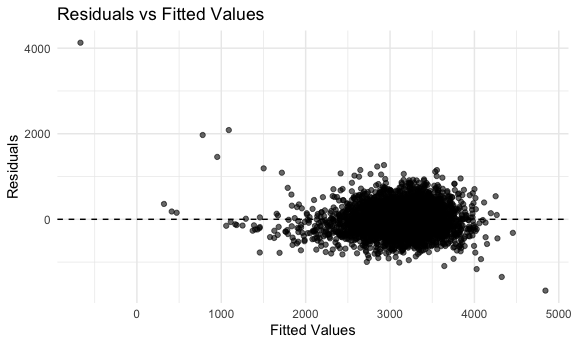

p8105_hw6_yl5505
================
Yan Li
2024-12-01

# Problem 1

``` r
# Load data using rnoaa::meteo_pull_monitors
weather_df = 
  rnoaa::meteo_pull_monitors(
    c("USW00094728"),
    var = c("PRCP", "TMIN", "TMAX"), 
    date_min = "2017-01-01",
    date_max = "2017-12-31") %>%
  mutate(
    name = recode(id, USW00094728 = "CentralPark_NY"),
    tmin = tmin / 10,
    tmax = tmax / 10) %>%
  select(name, id, everything())
```

    ## using cached file: /Users/Apple/Library/Caches/org.R-project.R/R/rnoaa/noaa_ghcnd/USW00094728.dly

    ## date created (size, mb): 2024-11-30 21:48:50.683779 (8.667)

    ## file min/max dates: 1869-01-01 / 2024-11-30

### Bootstraping

``` r
set.seed(123)

bootstrap_sample = function(data) {
  sample_frac(data, replace = TRUE)
}

bootstrap_results = tibble(bootstrap_id = 1:5000) |>
  mutate(
    bootstrap_sample = map(bootstrap_id, ~ bootstrap_sample(weather_df))
  )
```

### Fit model(with help)

``` r
bootstrap_results = bootstrap_results |>
  mutate(
    model_results = map(bootstrap_sample, ~ {
      model = lm(tmax ~ tmin, data = .x)
      r_squared = broom::glance(model)$r.squared
      coefficients = broom::tidy(model) |>
        filter(term %in% c("(Intercept)", "tmin")) |>
        pull(estimate)
      
      log_b0b1 = log(prod(coefficients))
      
      tibble(r_squared = r_squared, log_b0b1 = log_b0b1)
    })
  ) |>
  unnest(model_results)
```

### Plot(with help)

``` r
# Plot R^2 distribution
r2_plot = bootstrap_results |>
  ggplot(aes(x = r_squared)) +
  geom_histogram(binwidth = 0.01, fill = "blue", alpha = 0.6) +
  labs(
    title = "Distribution of R^2",
    x = "R^2",
    y = "Frequency"
  )

# Plot log(b0 * b1) distribution
log_b0b1_plot = bootstrap_results |>
  ggplot(aes(x = log_b0b1)) +
  geom_histogram(binwidth = 0.1, fill = "green", alpha = 0.6) +
  labs(
    title = "Distribution of log(b0 * b1)",
    x = "log(b0 * b1)",
    y = "Frequency"
  )

r2_plot + log_b0b1_plot
```


### 95% CIs

``` r
ci_r_squared = quantile(bootstrap_results$r_squared, probs = c(0.025, 0.975))
ci_log_b0b1 = quantile(bootstrap_results$log_b0b1, probs = c(0.025, 0.975))

ci_r_squared
```

    ##      2.5%     97.5% 
    ## 0.8945701 0.9271042

``` r
ci_log_b0b1
```

    ##     2.5%    97.5% 
    ## 1.964166 2.058364

# Problem 2

### Data cleaning

``` r
homicide = read.csv("./homicide-data.csv") |>
  janitor::clean_names() |>
  mutate(
    city_state = paste(city, state, sep = ", "),
    resolved = ifelse(disposition %in% c("Closed by arrest", "Closed without arrest"), 1, 0),
    victim_age = as.numeric(victim_age)
  ) |>
  filter(
    !city_state %in% c("Dallas, TX", "Phoenix, AZ", "Kansas City, MO", "Tulsa, AL"),
    victim_race %in% c("White", "Black")
  )
```

### logistic regression for Baltimore

``` r
baltimore = homicide |>
  filter(city_state == "Baltimore, MD")

baltimore_model = glm(
  resolved ~ victim_age + victim_sex + victim_race, 
  data = baltimore, 
  family = binomial()
)

baltimore_results = broom::tidy(baltimore_model) |>
  filter(term == "victim_sexMale") |>
  mutate(
    OR = exp(estimate), 
    CI_lower = exp(estimate - 1.96 * std.error),  
    CI_upper = exp(estimate + 1.96 * std.error) 
  )|>
    select(OR, CI_lower, CI_upper)

baltimore_results
```

    ## # A tibble: 1 × 3
    ##      OR CI_lower CI_upper
    ##   <dbl>    <dbl>    <dbl>
    ## 1 0.355    0.268    0.469

### each city

``` r
city = homicide |>
  group_by(city_state) |>
  nest() |>
  mutate(
    model = map(data, ~ glm(
      resolved ~ victim_age + victim_sex + victim_race, 
      data = .x, 
      family = binomial()
    )),
    results = map(model, ~ broom::tidy(.x) |>
                    filter(term == "victim_sexMale") |>
                    mutate(
                      OR = exp(estimate), 
                      CI_lower = exp(estimate - 1.96 * std.error), 
                      CI_upper = exp(estimate + 1.96 * std.error)
  ) |>
    select(OR, CI_lower, CI_upper))
  ) |>
  select(city_state, results) |>
  unnest(results)

city
```

    ## # A tibble: 47 × 4
    ## # Groups:   city_state [47]
    ##    city_state         OR CI_lower CI_upper
    ##    <chr>           <dbl>    <dbl>    <dbl>
    ##  1 Albuquerque, NM 0.430    0.148    1.25 
    ##  2 Atlanta, GA     0.512    0.328    0.799
    ##  3 Baltimore, MD   0.355    0.268    0.469
    ##  4 Baton Rouge, LA 0.319    0.166    0.612
    ##  5 Birmingham, AL  0.704    0.450    1.10 
    ##  6 Boston, MA      0.674    0.356    1.28 
    ##  7 Buffalo, NY     0.438    0.241    0.796
    ##  8 Charlotte, NC   0.301    0.151    0.598
    ##  9 Chicago, IL     0.391    0.321    0.476
    ## 10 Cincinnati, OH  0.206    0.104    0.408
    ## # ℹ 37 more rows

## PLOT

``` r
city |>
  arrange(OR) |>
  ggplot(aes(
    y = fct_reorder(city_state, OR),  
    x = OR, 
    xmin = CI_lower, 
    xmax = CI_upper
  )) +
  geom_pointrange() +
  labs(
    title = "Adjusted Odds Ratios (Male vs Female Victims) by City",
    x = "Odds Ratio (Male vs Female Victims)",
    y = "City"
  )
```

 -
The plot shows adjusted odds ratios comparing male and female victims
across cities. Cities like Fresno, CA, and Minneapolis, MN, have ORs
above 1, indicating higher male victimization odds, while cities like
New York, NY, and Long Beach, CA, have ORs below 1, suggesting lower
odds for males. Confidence intervals crossing 1 suggest no significant
gender difference in some cities.

# Problem 3

### Load and Clean

``` r
birthweight = read.csv("./birthweight.csv") |>
  janitor::clean_names() |>
  mutate(
    babysex = factor(babysex),
    malform = factor(malform),
    mrace = factor(mrace),
    frace = factor(frace)
  ) |>
  drop_na()

summary(birthweight)
```

    ##  babysex      bhead          blength           bwt           delwt      
    ##  1:2230   Min.   :21.00   Min.   :20.00   Min.   : 595   Min.   : 86.0  
    ##  2:2112   1st Qu.:33.00   1st Qu.:48.00   1st Qu.:2807   1st Qu.:131.0  
    ##           Median :34.00   Median :50.00   Median :3132   Median :143.0  
    ##           Mean   :33.65   Mean   :49.75   Mean   :3114   Mean   :145.6  
    ##           3rd Qu.:35.00   3rd Qu.:51.00   3rd Qu.:3459   3rd Qu.:157.0  
    ##           Max.   :41.00   Max.   :63.00   Max.   :4791   Max.   :334.0  
    ##     fincome      frace       gaweeks      malform     menarche    
    ##  Min.   : 0.00   1:2123   Min.   :17.70   0:4327   Min.   : 0.00  
    ##  1st Qu.:25.00   2:1911   1st Qu.:38.30   1:  15   1st Qu.:12.00  
    ##  Median :35.00   3:  46   Median :39.90            Median :12.00  
    ##  Mean   :44.11   4: 248   Mean   :39.43            Mean   :12.51  
    ##  3rd Qu.:65.00   8:  14   3rd Qu.:41.10            3rd Qu.:13.00  
    ##  Max.   :96.00            Max.   :51.30            Max.   :19.00  
    ##     mheight          momage     mrace        parity            pnumlbw 
    ##  Min.   :48.00   Min.   :12.0   1:2147   Min.   :0.000000   Min.   :0  
    ##  1st Qu.:62.00   1st Qu.:18.0   2:1909   1st Qu.:0.000000   1st Qu.:0  
    ##  Median :63.00   Median :20.0   3:  43   Median :0.000000   Median :0  
    ##  Mean   :63.49   Mean   :20.3   4: 243   Mean   :0.002303   Mean   :0  
    ##  3rd Qu.:65.00   3rd Qu.:22.0            3rd Qu.:0.000000   3rd Qu.:0  
    ##  Max.   :77.00   Max.   :44.0            Max.   :6.000000   Max.   :0  
    ##     pnumsga      ppbmi            ppwt           smoken           wtgain      
    ##  Min.   :0   Min.   :13.07   Min.   : 70.0   Min.   : 0.000   Min.   :-46.00  
    ##  1st Qu.:0   1st Qu.:19.53   1st Qu.:110.0   1st Qu.: 0.000   1st Qu.: 15.00  
    ##  Median :0   Median :21.03   Median :120.0   Median : 0.000   Median : 22.00  
    ##  Mean   :0   Mean   :21.57   Mean   :123.5   Mean   : 4.145   Mean   : 22.08  
    ##  3rd Qu.:0   3rd Qu.:22.91   3rd Qu.:134.0   3rd Qu.: 5.000   3rd Qu.: 28.00  
    ##  Max.   :0   Max.   :46.10   Max.   :287.0   Max.   :60.000   Max.   : 89.00

## buliding model

``` r
birthweight_model = lm(
  bwt ~ gaweeks + blength + babysex + wtgain,
  data = birthweight)
```

## Plot Residuals

``` r
birthweight = birthweight |>
  add_predictions(birthweight_model) |>
  add_residuals(birthweight_model)

ggplot(birthweight, aes(x = pred, y = resid)) +
  geom_point(alpha = 0.6) +
  geom_hline(yintercept = 0, linetype = "dashed") +
  labs(
    title = "Residuals vs Fitted Values",
    x = "Fitted Values",
    y = "Residuals"
  ) 
```



- The proposed model predicts birthweight using four key variables:
  gestational age, birth length, baby’s sex, and mother’s weight gain
  during pregnancy. These variables were selected based on their
  biological relevance to birthweight.
- The model provides a reasonable fit, and shows no major violations of
  linear regression assumptions.a few outliers suggest that additional
  refinement may improve its predictive performance.
