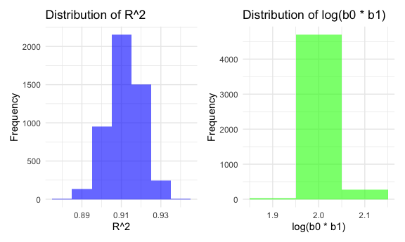

p8105_hw6_yl5505
================
Yan Li
2024-12-01

# Problem 1

``` r
# Load data using rnoaa::meteo_pull_monitors
weather_df = 
  rnoaa::meteo_pull_monitors(
    c("USW00094728"),
    var = c("PRCP", "TMIN", "TMAX"), 
    date_min = "2017-01-01",
    date_max = "2017-12-31") %>%
  mutate(
    name = recode(id, USW00094728 = "CentralPark_NY"),
    tmin = tmin / 10,
    tmax = tmax / 10) %>%
  select(name, id, everything())
```

    ## Registered S3 method overwritten by 'hoardr':
    ##   method           from
    ##   print.cache_info httr

    ## using cached file: /Users/Apple/Library/Caches/org.R-project.R/R/rnoaa/noaa_ghcnd/USW00094728.dly

    ## date created (size, mb): 2024-11-30 21:48:50.683779 (8.667)

    ## file min/max dates: 1869-01-01 / 2024-11-30

### Bootstraping

``` r
set.seed(123)

bootstrap_sample = function(data) {
  sample_frac(data, replace = TRUE)
}

bootstrap_results = tibble(bootstrap_id = 1:5000) |>
  mutate(
    bootstrap_sample = map(bootstrap_id, ~ bootstrap_sample(weather_df))
  )
```

### Fit model(with help)

``` r
bootstrap_results = bootstrap_results |>
  mutate(
    model_results = map(bootstrap_sample, ~ {
      model = lm(tmax ~ tmin, data = .x)
      r_squared = broom::glance(model)$r.squared
      coefficients = broom::tidy(model) |>
        filter(term %in% c("(Intercept)", "tmin")) |>
        pull(estimate)
      
      log_b0b1 = log(prod(coefficients))
      
      tibble(r_squared = r_squared, log_b0b1 = log_b0b1)
    })
  ) |>
  unnest(model_results)
```

### Plot(with help)

``` r
# Plot R^2 distribution
r2_plot = bootstrap_results |>
  ggplot(aes(x = r_squared)) +
  geom_histogram(binwidth = 0.01, fill = "blue", alpha = 0.6) +
  labs(
    title = "Distribution of R^2",
    x = "R^2",
    y = "Frequency"
  )

# Plot log(b0 * b1) distribution
log_b0b1_plot = bootstrap_results |>
  ggplot(aes(x = log_b0b1)) +
  geom_histogram(binwidth = 0.1, fill = "green", alpha = 0.6) +
  labs(
    title = "Distribution of log(b0 * b1)",
    x = "log(b0 * b1)",
    y = "Frequency"
  )

r2_plot + log_b0b1_plot
```



### 95% CIs

``` r
ci_r_squared = quantile(bootstrap_results$r_squared, probs = c(0.025, 0.975))
ci_log_b0b1 = quantile(bootstrap_results$log_b0b1, probs = c(0.025, 0.975))

ci_r_squared
```

    ##      2.5%     97.5% 
    ## 0.8945701 0.9271042

``` r
ci_log_b0b1
```

    ##     2.5%    97.5% 
    ## 1.964166 2.058364

# Problem 2

### Data cleaning

``` r
homicide = read.csv("./homicide-data.csv") |>
  janitor::clean_names() |>
  mutate(
    city_state = paste(city, state, sep = ", "),
    resolved = ifelse(disposition %in% c("Closed by arrest", "Closed without arrest"), 1, 0),
    victim_age = as.numeric(victim_age)
  ) |>
  filter(
    !city_state %in% c("Dallas, TX", "Phoenix, AZ", "Kansas City, MO", "Tulsa, AL"),
    victim_race %in% c("White", "Black")
  )
```

### logistic regression for Baltimore

``` r
baltimore = homicide |>
  filter(city_state == "Baltimore, MD")

baltimore_model = glm(
  resolved ~ victim_age + victim_sex + victim_race, 
  data = baltimore, 
  family = binomial()
)

baltimore_results = broom::tidy(baltimore_model) |>
  filter(term == "victim_sexMale") |>
  mutate(
    OR = exp(estimate), 
    CI_lower = exp(estimate - 1.96 * std.error),  
    CI_upper = exp(estimate + 1.96 * std.error) 
  )|>
    select(OR, CI_lower, CI_upper)

baltimore_results
```

    ## # A tibble: 1 × 3
    ##      OR CI_lower CI_upper
    ##   <dbl>    <dbl>    <dbl>
    ## 1 0.355    0.268    0.469

### each city

``` r
city = homicide |>
  group_by(city_state) |>
  nest() |>
  mutate(
    model = map(data, ~ glm(
      resolved ~ victim_age + victim_sex + victim_race, 
      data = .x, 
      family = binomial()
    )),
    results = map(model, ~ broom::tidy(.x) |>
                    filter(term == "victim_sexMale") |>
                    mutate(
                      OR = exp(estimate), 
                      CI_lower = exp(estimate - 1.96 * std.error), 
                      CI_upper = exp(estimate + 1.96 * std.error)
  ) |>
    select(OR, CI_lower, CI_upper))
  ) |>
  select(city_state, results) |>
  unnest(results)

city
```

    ## # A tibble: 47 × 4
    ## # Groups:   city_state [47]
    ##    city_state         OR CI_lower CI_upper
    ##    <chr>           <dbl>    <dbl>    <dbl>
    ##  1 Albuquerque, NM 0.430    0.148    1.25 
    ##  2 Atlanta, GA     0.512    0.328    0.799
    ##  3 Baltimore, MD   0.355    0.268    0.469
    ##  4 Baton Rouge, LA 0.319    0.166    0.612
    ##  5 Birmingham, AL  0.704    0.450    1.10 
    ##  6 Boston, MA      0.674    0.356    1.28 
    ##  7 Buffalo, NY     0.438    0.241    0.796
    ##  8 Charlotte, NC   0.301    0.151    0.598
    ##  9 Chicago, IL     0.391    0.321    0.476
    ## 10 Cincinnati, OH  0.206    0.104    0.408
    ## # ℹ 37 more rows

## PLOT

``` r
city |>
  arrange(OR) |>
  ggplot(aes(
    y = fct_reorder(city_state, OR),  
    x = OR, 
    xmin = CI_lower, 
    xmax = CI_upper
  )) +
  geom_pointrange() +
  labs(
    title = "Adjusted Odds Ratios (Male vs Female Victims) by City",
    x = "Odds Ratio (Male vs Female Victims)",
    y = "City"
  )
```


